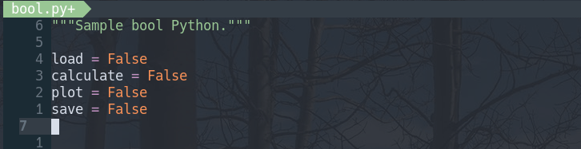

# toggle-bool.nvim

This is a **minimal** Neovim plugin that can be used to toggle various boolean-like values.



The toggles included by default are:
- `False` ←→ `True`
- `false` ←→ `true`

The toggle works for the first match on the current line starting at the cursor position. 

Additional toggles can be [setup](#setup) by the user.

This plugin is a Lua port of the Vim version [gerazov/vim-toggle-bool](https://github.com/gerazov/vim-toggle-bool).

## Setup

The plugin can be installed via a plugin manager. 

For [packer.nvim](https://github.com/wbthomason/packer.nvim) it's:

```lua
use 'gerazov/toggle-bool.nvim'
```

To setup the plugin run:
```lua
require("toggle-bool").setup {
    mapping = "<leader>tt",
	additional_toggles = {
        Yes = 'No',
        On = 'Off',
        ["0"] = "1",
        Enable = 'Disable',
        Enabled = 'Disabled',
        First = 'Last',
        Before = 'After',
        Persistent = 'Ephemeral',
        Internal = 'External',
        Ingress = 'Egress',
        Allow = 'Deny',
        All = 'None',
    },
}
```

## Usage

The plugin exposes a single function `toggle_bool` that is mapped to the specified `mapping`. 

Alternatively, it can be called via:
```lua
:lua require("toggle-bool").toggle_bool()
```

## Similar plugins

- [rmagatti/alternate-toggler](https://github.com/rmagatti/alternate-toggler) - a bit heavier, toggles current word under cursor via yanking
- [monaqa/dial.nvim](https://github.com/monaqa/dial.nvim) - a more powerful cycler plugin supporting dates, colors etc.
- [johmsalas/shake.nvim](https://github.com/johmsalas/shake.nvim) - a more general purpose string transformation plugin that can be used for toggling booleans
- [gerazov/vim-toggle-bool](https://github.com/gerazov/vim-toggle-bool) - VIML toggler based on `switch.vim`
- [AndrewRadev/switch.vim](https://github.com/AndrewRadev/switch.vim) - a powerful general purpose string transformation plugin
